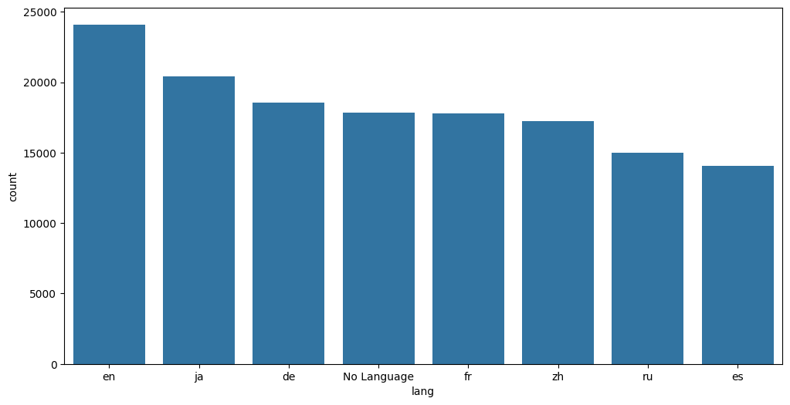
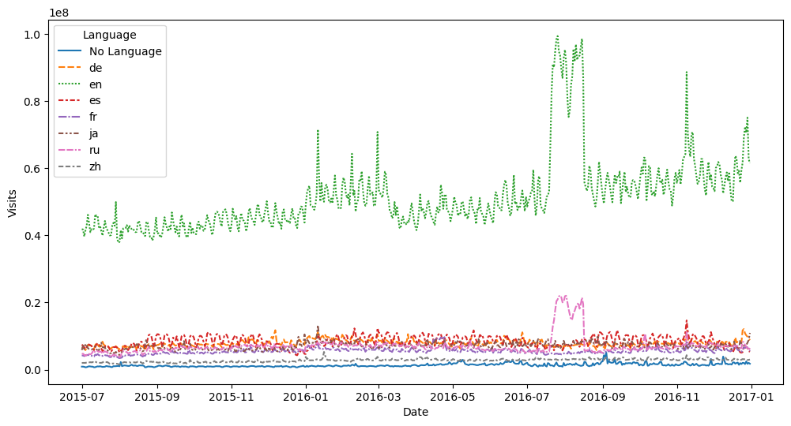
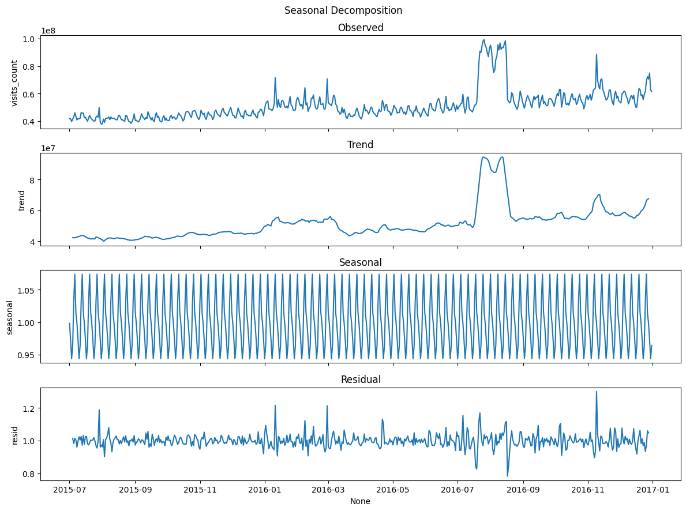
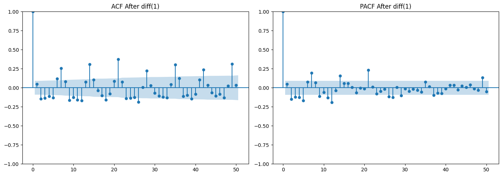
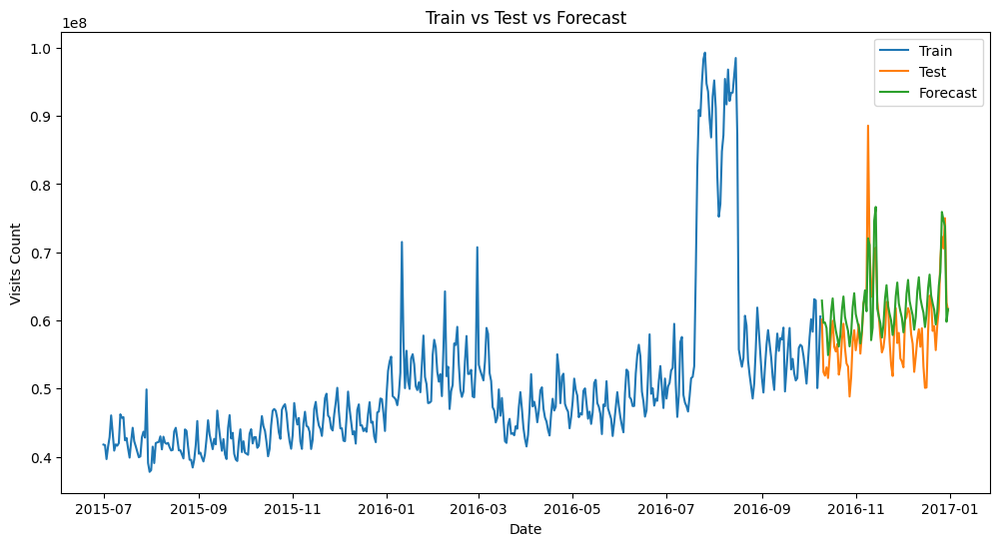
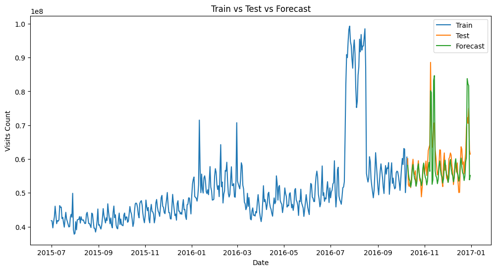
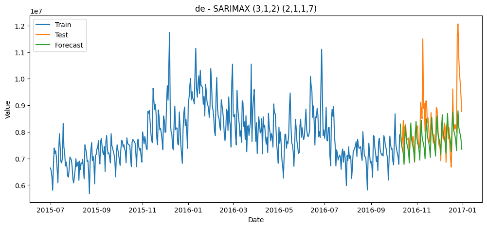

---

Part of the [DSML Business Case Studies](https://github.com/tarini-py/DSML-Business-Case-Studies) portfolio.

---

# AdEase - Website Views Forecasting for Ad placement(Time Series Analysis)


> A multi-language time series forecasting pipeline that predicts daily Wikipedia page views so AdEase can place the right ads, on the right pages, at the right time — cutting forecast error to **5.57% MAPE** on the highest-traffic segment, and generalizing automatically across 8 languages.

[](https://www.linkedin.com/in/mr-tps/)

## 🚀 Run on Google Colab
[](https://colab.research.google.com/drive/1BwCdtosCGyofHvkO5x94A1SL94pazCXU?usp=sharing)

## 📊 View on Kaggle
[](https://www.kaggle.com/code/tariniprasad0x/out-adease-time-series-website-views-forecasting)

## Table of Contents
- [Overview](#overview)
- [Dataset](#dataset)
- [Data Cleaning & Feature Engineering](#data-cleaning--feature-engineering)
- [Exploratory Data Analysis](#exploratory-data-analysis)
- [Time Series Methodology — English Deep Dive](#time-series-methodology--english-deep-dive)
- [Automated Multi-Language Forecasting Pipeline](#automated-multi-language-forecasting-pipeline)
- [Results & Leaderboard](#results--leaderboard)
- [Business Recommendations](#business-recommendations)
- [Where Else This Applies](#where-else-this-applies)
- [Tech Stack](#tech-stack)
- [Repository Structure](#repository-structure)
- [How to Run](#how-to-run)

## Overview

AdEase is an ad infrastructure company built around three AI modules — **Design, Dispense, and Decipher** — that together power an end-to-end digital advertising pipeline for its clients. Clients span multiple regions and need to know how their ads will perform on pages in different languages *before* they commit spend.

Working as part of AdEase's Data Science team, the task was: given ~550 days of daily view counts for **145,063 Wikipedia pages**, forecast future traffic well enough to plan and optimize ad placement across languages and regions.

**Highlights:**
- Engineered clean features out of composite, inconsistently-formatted page identifiers using regex, with fallback handling for edge cases
- Identified and corrected a double-counting risk in the raw traffic data (bot vs. human traffic) before any modeling began
- Iterated through ARIMA → SARIMA → SARIMAX → Prophet, validating each step with the Augmented Dickey-Fuller test and ACF/PACF diagnostics
- Took Prophet from **11.89% → 5.51% MAPE** on the flagship English series through a 72-configuration grid search
- Built a **fully automated pipeline** that auto-detects differencing order, seasonality, and ARIMA orders, then fits, tunes, and benchmarks SARIMAX vs. Prophet independently for all 8 language segments

## Dataset

Two files were provided:

| File | Shape | Description |
|---|---|---|
| `train_1.csv` | 145,063 × 551 | One row per Wikipedia article, one column per date (2015-07-01 → 2016-12-31). Cell values = daily view counts. |
| `Exog_Campaign_eng` | 550 × 1 | A binary flag marking dates with a marketing campaign or notable event, for English pages only — used as an exogenous regressor. |

Each page identifier packs four attributes into one string:

```
SPECIFIC_NAME _ LANGUAGE.wikipedia.org _ ACCESS_TYPE _ ACCESS_ORIGIN
```

e.g. the page name, the Wikipedia language domain, the device used to access it, and whether the request came from a human browser or a bot/spider agent.

## Data Cleaning & Feature Engineering

### Parsing the composite page identifier

A single regex split the identifier into four usable columns in one pass:

```python
pattern = r'^(.+?)_([a-z]{2,3})\.wikipedia\.org_([^_]+)_([^_]+)$'
df[['title', 'lang', 'access_type', 'access_origin']] = df['Page'].str.extract(pattern)
```

Not every page matched — some sit on non-language-coded domains (e.g. Wikimedia Commons) rather than `xx.wikipedia.org`. Rather than dropping those rows, a fallback rebuilt `title`, `access_type`, and `access_origin` from the right-hand side using `str.rsplit('_', n=3)`, leaving `lang` unset for these pages — which naturally bucketed them as a distinct **"No Language"** segment instead of silently losing them.

Raw article counts by language, before any filtering:

| Language | Articles |
|---|---|
| English (en) | 24,108 |
| Japanese (ja) | 20,431 |
| German (de) | 18,547 |
| *No Language* | 17,855 |
| French (fr) | 17,802 |
| Chinese (zh) | 17,229 |
| Russian (ru) | 15,022 |
| Spanish (es) | 14,069 |



Most pages were also `all-access` type and `all-agents` origin (~110K of 145K), which set up the next problem.

### Isolating human traffic

Two categories in this dataset are aggregates, not independent segments:

- `all-access` ≈ `desktop` + `mobile-web` + other device types
- `all-agents` ≈ `human traffic` + `spider` (bot) traffic

Summing every variant together would double count views, and treating spider hits as ad-viewing humans would overstate the addressable audience for AdEase's clients. So the pipeline:

1. Keeps only `all-access` rows (avoids re-summing device-level components into the aggregate)
2. Computes **Human Traffic = all-agents − spider** for each page, joining the two access-origin variants on `(title, lang)`

This inner join — which only keeps pages that have *both* an `all-agents` and a `spider` row — trimmed the working set from **145,063 pages down to 34,967 pages** of clean, bot-filtered human traffic, which became the base for every model downstream.

## Exploratory Data Analysis

The 34,967 human-traffic pages were aggregated into 8 daily language-level series:



| Language | Avg. Daily Views | Total Views (550 days) |
|---|---|---|
| **English (en)** | **51.6M** | **28.38B** |
| Spanish (es) | 8.35M | 4.59B |
| German (de) | 7.88M | 4.34B |
| Japanese (ja) | 7.11M | 3.91B |
| Russian (ru) | 7.07M | 3.89B |
| French (fr) | 5.50M | 3.03B |
| Chinese (zh) | 2.75M | 1.51B |
| No Language | 1.35M | 0.74B |

English dwarfs every other segment — roughly 6x the next-largest language by average daily traffic — making it both the highest-value and highest-priority segment to forecast accurately. Russian traffic showed the widest swings day to day, an early signal that it would be harder to model cleanly.

Decomposing the English series (multiplicative, weekly period) separates that raw signal into trend, weekly seasonality, and residual noise — confirming a clear upward trend and strong 7-day cyclicality worth modeling explicitly:



## Time Series Methodology — English Deep Dive

The English series was used to prototype the full modeling workflow before generalizing to every language. Data was split 467 days train / 83 days test (85/15).

**Stationarity (Augmented Dickey-Fuller test):**

| Series | ADF Statistic | p-value | Conclusion |
|---|---|---|---|
| Raw | -2.67 | 0.079 | Fail to reject H₀ — non-stationary |
| After 1st-order differencing | -6.69 | 4.16e-09 | Reject H₀ — **stationary** |

ACF/PACF plots on the differenced series guided the choice of AR/MA orders:



**Model iteration:**

| Step | Model | Configuration | Test MAPE |
|---|---|---|---|
| 1 | ARIMA | (p,d,q) = (0,1,0) | 8.43% |
| 2 | SARIMA | (0,1,0)(3,1,1)₇ | 6.62% |
| 3 | SARIMAX | + campaign exogenous flag | 7.22% |
| 4 | SARIMAX | + campaign + weekend/weekday flags | 7.22% |
| 5 | Prophet (default) | built-in weekly + custom monthly seasonality, untuned | 11.89% |
| 6 | **Prophet (tuned)** | grid search, 72 configurations | **5.51%** |

SARIMAX with a full set of regressors:



Prophet's first pass (11.89% MAPE) was actually worse than SARIMA — a good reminder that an untuned model isn't automatically competitive. A grid search over `changepoint_prior_scale`, `seasonality_prior_scale`, `seasonality_mode`, `n_changepoints`, and Fourier order (72 combinations, validated on the last 30 training days) found a far better configuration — `changepoint_prior_scale=0.01`, `seasonality_prior_scale=1`, `seasonality_mode='multiplicative'`, `n_changepoints=10`, weekly `fourier_order=2` — more than halving the error to **5.51% MAPE**, the best single-series result in the notebook:



## Automated Multi-Language Forecasting Pipeline

Manually re-running this workflow for every language wouldn't scale, so the notebook generalizes it into a self-tuning pipeline that, per language:

- **Detects the differencing order `d`** by iteratively differencing and re-running the ADF test until the series is stationary
- **Detects the seasonal period `m`** by scanning the ACF for the strongest lag beyond the 95% significance threshold
- **Detects `(p,q)` and seasonal `(P,Q)`** from where the ACF/PACF cross the significance threshold, with safety caps and automatic correction for lags that overlap between the seasonal and non-seasonal terms
- **Fits SARIMAX** with language-specific exogenous regressors (a shared `is_weekend` flag for all languages, plus the campaign flag for English only)
- **Grid-searches and fits Prophet** independently for that language
- **Scores both on test-set MAPE and keeps the winner**

Applied to German, for example, the pipeline independently detected a different order and correctly identified SARIMAX as the stronger fit:



One interesting side-effect of full automation: for English, the auto-detector picked up a **21-day** seasonal cycle rather than the 7-day cycle assumed in the manual walkthrough above — and that looser assumption produced an even better SARIMAX fit (6.34% vs. 7.22% MAPE), showing the value of letting the diagnostics drive the parameters rather than defaulting to the "obvious" weekly pattern.

## Results & Leaderboard

Final test-set MAPE for SARIMAX vs. Prophet, across all 8 language segments:

| Language | (p,d,q) | (P,D,Q,m) | SARIMAX MAPE | Prophet MAPE | Best Model |
|---|---|---|---|---|---|
| **English (en)** | (0,1,0) | (2,1,2,21) | 6.34% | **5.57%** | Prophet |
| Chinese (zh) | (0,1,0) | (2,1,1,7) | 21.88% | **7.08%** | Prophet |
| Japanese (ja) | (3,1,3) | (2,1,1,7) | **9.47%** | 10.47% | SARIMAX |
| French (fr) | (2,1,2) | (2,1,1,7) | 36.98% | **13.15%** | Prophet |
| German (de) | (3,1,2) | (2,1,1,7) | **6.95%** | 15.91% | SARIMAX |
| Spanish (es) | (3,0,3) | (2,1,2,7) | **16.87%** | 17.04% | SARIMAX |
| Russian (ru) | (3,0,3) | (0,0,0,0) | **26.16%** | 26.68% | SARIMAX |
| No Language | (2,0,3) | (0,0,0,0) | 67.30% | **30.67%** | Prophet |

- **Prophet** won for English, Chinese, French, and No Language
- **SARIMAX** won for Japanese, German, Spanish, and Russian
- Most series needed first-order differencing and weekly seasonality to become stationary; only Russian and No Language showed no detectable seasonal structure
- **No Language** was the hardest segment by far (30.67% MAPE) — consistent with it being a catch-all bucket for pages that didn't cleanly parse into a language, which likely means noisier, less homogeneous traffic underneath

## Business Recommendations

- **Prioritize English for ad placement and forecasting investment** — it carries roughly 6x the traffic of the next-largest language and is also the most forecastable (5.57% MAPE)
- **Mid-tier languages (Spanish, German, Japanese, Russian)** offer solid regional targeting opportunities and are forecastable enough (7–17% MAPE) to support planned campaigns
- **High-error segments — especially "No Language" and French SARIMAX (67% / 37% MAPE) — need human review rather than fully automated trust**; forecasts there should inform, not dictate, ad spend decisions
- **Forecast accuracy across the board would likely improve with richer exogenous signals** — holidays, more granular campaign/event data, and operational or seasonal business signals beyond the single English campaign flag used here

## Where Else This Applies

The same pattern — decompose, test for stationarity, compare classical and additive models, automate per-segment — extends well beyond ad placement:

- **Dynamic pricing**, e.g. airline or hotel demand forecasting
- **Campaign planning**, e.g. e-commerce demand forecasting
- **Capacity planning**, e.g. CDN or infrastructure traffic optimization
- **Trend detection**, e.g. stock market or financial time series

With more data, this pipeline could also extend into real-time forecasting, personalized ad targeting (by combining forecasts with user demographics, device type, and geography), and anomaly detection on top of the same per-language models.

## Tech Stack

- **Data wrangling:** pandas, numpy, `re`
- **Visualization:** matplotlib, seaborn
- **Statistical modeling:** statsmodels (`seasonal_decompose`, `adfuller`, `acf`/`pacf`, `SARIMAX`)
- **Forecasting:** Prophet
- **Evaluation:** scikit-learn (`mean_absolute_percentage_error`)
- **Tuning:** grid search via `itertools.product`

## Repository Structure

```
adease-website-views-forecasting/
├── README.md
├── AdEase_Time_Series_Website_Views_forecasting.ipynb
└── images/
    ├── 01_traffic_trends_by_language.png
    ├── 02_language_distribution.png
    ├── 03_seasonal_decomposition.png
    ├── 04_acf_pacf_after_differencing.png
    ├── 05_sarimax_forecast_english.png
    ├── 06_tuned_prophet_forecast_english.png
    └── 07_pipeline_sarimax_german.png
```

## How to Run

```bash
pip install pandas numpy matplotlib seaborn statsmodels prophet scikit-learn
```

The notebook pulls `train_1.csv` and `Exog_Campaign_eng` via `gdown` from Google Drive at runtime. Run the notebook top to bottom — the automated pipeline section will re-detect parameters and re-fit both models for all 8 languages, so it takes noticeably longer to execute than the earlier single-series sections.

---
